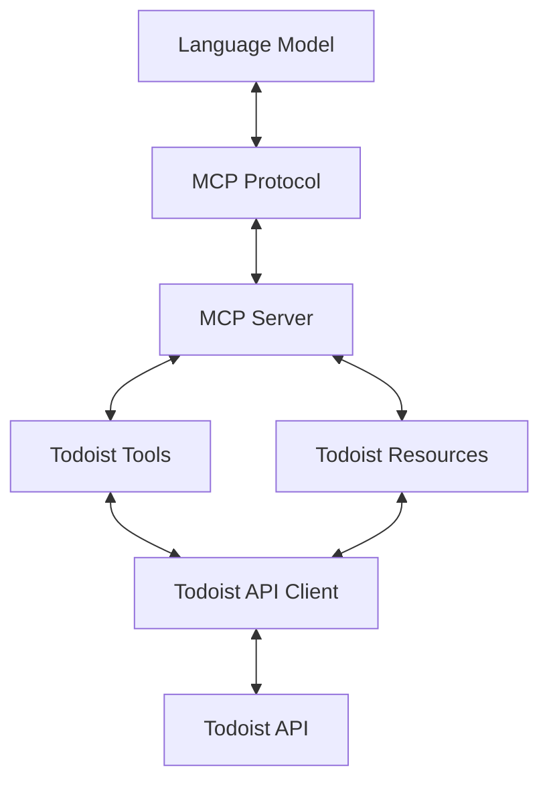

# System Patterns: MCP-Todoist Integration

## System Architecture

The MCP-Todoist integration follows a layered architecture pattern with clear separation of concerns:

### Layers

1. **MCP Protocol Layer**: Handles communication with language models using the Model Context Protocol.
2. **MCP Server Layer**: Manages the server lifecycle, registration of tools and resources.
3. **Tools & Resources Layer**: Implements specific Todoist operations as MCP tools and resources.
4. **API Client Layer**: Interacts with the Todoist API using the official client.

## Key Technical Decisions

1. **FastMCP Server Implementation**: We're using the FastMCP implementation provided by the Python MCP SDK for simplified server creation.

2. **Official Todoist API Client**: We're using the official Todoist API Python client for reliable API communication.

3. **Token-Based Authentication**: We're using API token-based authentication for simplicity and security.

4. **Error Handling Strategy**: All API calls are wrapped with appropriate error handling to ensure robustness.

5. **Clearly Defined Tool Interfaces**: Each Todoist operation is exposed through a well-defined tool interface with clear parameters.

## Design Patterns in Use

1. **Dependency Injection**: The Todoist API client is injected into tools and resources, making them testable and modular.

2. **Factory Pattern**: Used for creating and initializing different types of MCP server objects.

3. **Adapter Pattern**: Adapting the Todoist API calls to fit the MCP tool and resource interfaces.

4. **Command Pattern**: Each Todoist operation is encapsulated as a command (tool) with all necessary information.

5. **Repository Pattern**: For abstracting the data access layer from the MCP tools.

## Component Relationships

1. **MCP Server → Tools/Resources**: The server registers and manages tools and resources, which are the interface to Todoist functionality.

2. **Tools/Resources → Todoist Client**: Tools and resources use the Todoist client to execute operations.

3. **Config → All Components**: Configuration is accessible to all components for authentication and settings.

## Data Flow

1. **Language Model to Todoist**:
   - Language model invokes MCP tool
   - MCP server routes to appropriate tool implementation
   - Tool implementation uses Todoist client to execute operation
   - Results flow back through the same path

2. **Todoist to Language Model**:
   - Language model requests MCP resource
   - MCP server routes to appropriate resource implementation
   - Resource implementation uses Todoist client to fetch data
   - Data flows back to language model through MCP

## Extensibility Points

1. **New Tools**: Additional Todoist functionality can be added as new tools.
2. **New Resources**: Additional data access can be added as new resources.
3. **Enhanced Authentication**: Can be extended to support OAuth if needed.
4. **Advanced Querying**: Can be enhanced with more sophisticated data filtering.
